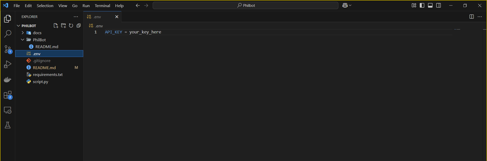

# Philbot

Author: Jared Eller
Course: SDEV 450 (Fall 2024)

Overview:
A chatbot that communicates with a user via calls to an LLM through Groq Cloud's API and which uses a customized Chroma vector database better inform its responses about anything and everything written by ancient Greek philosopher Plato. This project was created as a result of my desire to learn more about the field of Philosophy, sparked by my experience with Philosophy 101 during the Summer 2024 quarter.

Setup:
1. Create a file in the root directory called ".env" and place your Groq Cloud API Key in there. Environment variable should be called "API_KEY".

2. Run "pip install -r requirements.txt" in your terminal of choice
3. Click the "run" button in your IDE of choice while the window is focused on the file "script.py"

To exit:
Type "exit" or "bye" and Philbot will exit.

Implementation of techniques:
This project mainly relies on Groq Cloud's API to make calls to the "llama-3.1-8b-instant" LLM. It also relies on a collection of documents authored by Plato which are split into chunks and inserted into a vector database to further augment its knowledge of the philosophies of Plato and Socrates.

All actions run in "script.py", but proper installation requires "requirements.txt" and the contents of the "docs" folder, both of which should be included with the Github repository.

Capabilities:
-The project seems to be good at drawing comparisons between the subject material and other, similar concepts; I made a comparison between Plato's concept of the tripartite soul and Freud's idea of the supergo, id, and ego. It acknowledged that there was a little similarity, but that the conversation was veering into a different field of study.
-Summarizing seems to be something that the project does well; asking it to summarize any of the texts in the vector database (or even all of them!) leads to brief but clear paraphrases of each philosophical writing.
-Follows user-provided templates well. Upon asking it to provide three key points from each book of The Republic, it did so without any issue (besides hitting the token limit, which I have since raised).
-Somewhat able to apply the ideas of Socrates and Plato to contemporary issues; mileage varies depending on the issues being asked about.
-Able to build off of the content of messages sent to it and draw similarities between the messages being sent and ideas from other philosophers.

Weaknesses:
-Sometimes responses "short out", and all that's received in the console is the word "response" from the API call.
-Strictness: it seems a little strict when it comes to other subjects; this is likely due to me erring on the conservative side to prevent the project from entertaining bogus questions (like "what's your favorite type of pizza"), but philosophy is a very, VERY broad field with millennia worth of thoughts and records dedicated to it. The chatbot doesn't seem too keen to veer into other subject material, though, and while it can draw comparisons between subjects from one field of study and another, it's very quick to try to steer the conversation back towards subjects that are very explicitly philosophy.
-Speed: Philbot takes a while to get going. Once the project is spun up, it responds to user messages very quickly, but it takes a little over a minute to actually get started on my hardware.
-Repetition: Depending on the subject material, Philbot can be a bit repetitive with certain concepts; it repeatedly brought up Jean Baudrillard's "simulacrum" despite me having already acknowledged it in the past.

Improvements:
-An actual frontend (either application-based or web-based)
-More writings of Plato, as well as other philosophers
-Lower the startup lag, or at least put some kind of loading screen/progress bar in
-Add a "Persona" functionality where the end-user fills in information about their own philsophical beliefs and Philbot can then read from that to better understand the user